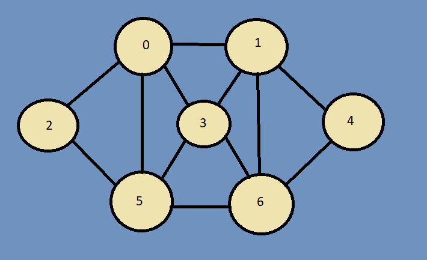
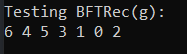
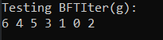
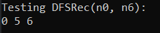
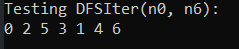
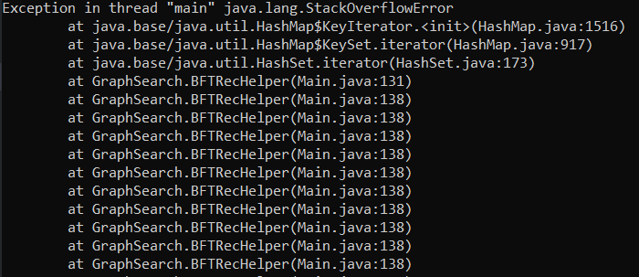

This repository holds an implementation of a graph in Java.

Images below are results of tests for some of the functions using the sample graph above.

Below is an error made when attempting to do a recursive BFT traversal on a 10000 element linked list.

